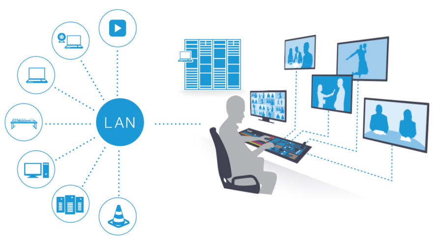

# NDI Overview

### NDI Background 

When we first introduced NDI, we made the bold assertion that ‘the future of the video industry would be one in which video is transferred easily and efficiently in IP space’, and that this approach ‘would largely supplant current industry-specific connection methods (HDMI, SDI, etc.) in the production pipeline’. By now, this breathtaking transformation is far advanced, and hundreds of millions of users have countless NDI-enabled applications and systems at their fingertips.

That a/v signals will predominantly be carried over IP is no longer in doubt, and vestigial contentions to the contrary are largely being phased out. All modern video rendering, graphics systems and switchers run on computers. Cameras and most other production devices use computer-based systems internally, too. Most of such systems communicate via IP – and _NDI is serving this purpose far more often than any other protocol_.

NDI doesn’t simply substitute Newtork cables for SDI cables – It Changes Everything!

Handling video over networks opens a world of new creative and pipeline possibilities. Consider a comparison: The Internet, too, _could_ be narrowly described as a transport medium, moving data from point A to point B. Yet, by connecting _everyone and_ _everything_ _everywhere_ together, it is much more than the sum of its parts. Likewise, introducing video into the IP realm with virtually endless potential connections delivers exciting creative new possibilities and ever-expanding workflow benefits.

NDI allows multiple video systems to identify and communicate with one another over IP, and to encode, transmit and receive many streams of very high quality, low latency, frame-accurate video, and audio in real time.

NDI supports many video streams on a shared local network connection and can operate bi-directionally. Its encoding algorithm is resolution and framerate independent, supports 4K and beyond, along with 16 channels and more of floating-point audio and 16-bit video.

NDI also includes tools to implement video access rights, grouping, bi-directional metadata, IP commands, routing, discovery servers and more. Its superb performance over standard GigE networks make it possible to transition facilities to an incredibly versatile IP video production pipeline without negating existing investments in SDI cameras and infrastructure or requiring costly new high-speed network infrastructures.

Wide distribution within a facility becomes a simple, versatile, and economical reality. And NDI also revolutionizes ingest and post-production by making fully time-synced capture on a massive scale a reality.
