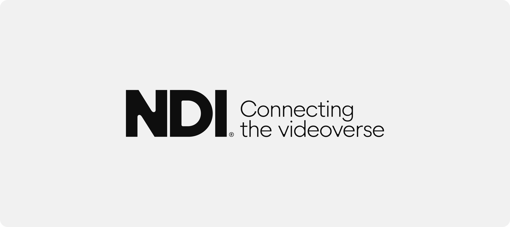

# The vision of NDI

### _**Manifesto**_

_**Video** has transported images, information, ideas, and stories for over a century._ &#x20;

_And over the last decade, we've been working behind cameras to push the envelope every time someone presses record. With each innovation, we've helped bring partners, creators, and users closer to the future of video._

_Now, **the future of video is here**. The little red dot is everywhere. Video is not just moving images anymore. It's transferring data. More than something we consume, video generates new ideas and businesses every day. It's not how we transport experiences. Video is the experience:_&#x20;

_From a **state-of-the-art overseas production** to the **room of a gaming streamer**;_&#x20;

_from a **smart network of traffic flow analysis** to the most **challenging remote surgeries**;_&#x20;

_from an **auction with thousands of bidders on social media** to a **parent calming their baby through a monitor.**_&#x20;

_As video evolves, it unveils a common thread connecting all these new use cases and exciting possibilities. **One breakthrough that redefines video**:_&#x20;

<figure><figcaption></figcaption></figure>

### We believe **there is no video without connection**.  

Looking into the next steps of video-based industries, you find innovation and the rise of new use cases everywhere: video production going remote, collaborative, virtual, cloud-based, and AI, all at the same time; video streaming is growing with no limits, and live e-commerce is establishing itself as one of the main formats of e-commerce; a very big percentage of IoT is built using video, which is becoming the ultimate sensor for humans and machines.​; many specialized use cases are becoming more common in surveillance, monitoring, smart cities, or hybrid learning and work.

The future of video is one in which content is transferred easily and efficiently via the Internet Protocol (IP). This global network will largely supplant and become far too decentralized and open-ended for current industry-specific connection formats like HDMI, SDI, etc., in any type of video workflow or production pipeline.&#x20;

We refer to this next iteration of the world video as the **videoverse:** _a connected global environment that contains all devices, technologies, services, and businesses based on creating, sharing, coordinating, and consuming video, either by humans or machines.​_

**NDI is the technology connecting it.**

### The current limitations to connectivity 

When we think about video connectivity, it’s natural to consider the ever-expanding possibilities, more options, and unlimited potential.

But the fact is that, as with all technology-driven revolutions, the existing way of doing things still presents more limitations than we would like:

*   **Dependency on equipment and budget**

    Currently, the number and quality of connections are very dependent on cost, available cables, infrastructure, and bandwidth.
* **Complexity and need for specialized expertise**\
  Most connectivity solutions require networking expertise to set up and troubleshoot. They struggle to provide a simple, user-friendly experience.
* **Too many working connectivity protocols**\
  There can be many protocols in the same workflow, requiring a lot of conversion and understanding of different technologies. Alternatively, some products only operate in closed ecosystems, which reduces overall interoperability.

NDI is removing the limits to video connectivity.

NDI is removing the limits to video connectivity by&#x20;

NDI enables transitioning to an incredibly versatile IP video pipeline without negating existing investments in SDI and HDMI cameras and infrastructure or costly new high-speed network infrastructures.
