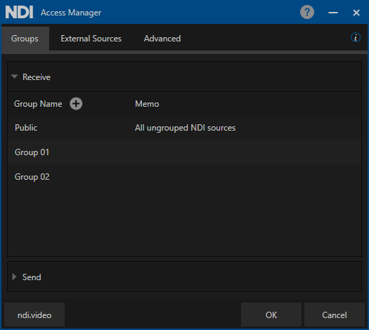

---
layout:
  title:
    visible: true
  description:
    visible: false
  tableOfContents:
    visible: true
  outline:
    visible: true
  pagination:
    visible: true
---

# NDI Groups

NDI groups enhance the efficiency and management of NDI-based workflows by providing a structured way to organize and control the visibility and access of NDI sources and destinations within a network.

#### _NDI devices support two different kinds of Groups: **Send** and **Receive**._

A device can be part of different Groups, some Groups only in the Send or Receive mode:

<figure><figcaption></figcaption></figure>

#### Scenarios

In this scenario, **NDI Device 01** is sending discovery information to Groups 02 and 04. Devices part of the **Receive Groups 02** and **04** can discover and receive NDI streams from **Device 01.**

<figure><figcaption></figcaption></figure>

**NDI Device 02** is sending discovery information in Groups: Public, 01, 02, and 04.

<figure><figcaption></figcaption></figure>

**NDI Device 03** is sending discovery information in Groups: Public and 03.

<figure><figcaption></figcaption></figure>

**There are different ways to define Groups in NDI Devices:**

In MS Windows and MacOS, Groups are defined in the NDI Access Manager, which is part of the free NDI Tools:

The Groups string for each Send and Receive operation must not exceed 248 bytes in length, which means that the total length of the combined Group names should not exceed 248 characters.

In Linux, NDI Groups can be defined in the NDI configuration file located in the home directory of the effective user: "ndi-config.v1.json"

Here is the way to configure Groups in the configuration file:

`},`\
`"groups": {`\
`"send": "Public",`\
`"recv": "Public,Group 01,Group 02"`\
`},`

_Hardware NDI Devices must support NDI Groups to be compliant with the NDI standard specifications._

Here are some examples of hardware devices with NDI Groups support:

<figure><figcaption></figcaption></figure>

<figure><figcaption></figcaption></figure>

<figure><figcaption></figcaption></figure>
