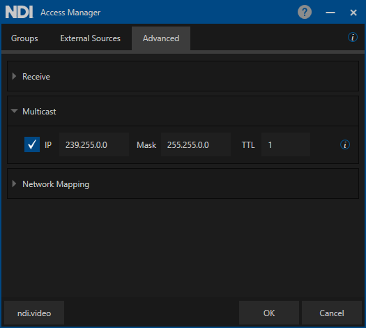

# 10. Multicast

To ensure packet[^1] loss, NDI supports multicast-based video sources using multicast UDP with forward error correction. Multicasting allows for a single NDI source to be delivered to multiple receivers by replicating the NDI packets from the sender to any number of receivers. It is essential to be aware that using multicast on a poorly configured network can produce undesirable results and cripple network performance. For this reason, multicast sending is disabled by default.

For successful multicasting, the use of[ Internet Group Management Protocol](#user-content-fn-2)[^2] (IGMP) is encouraged. IGMP allows the receiving NDI systems to request access to the sender. Without IGMP querying and snooping, Multicast traffic is treated the same as broadcast transmission resulting in packet forwarding to all ports on the network. With IGMP snooping, multicast NDI traffic is forwarded only to the receivers that subscribe to the multicast NDI stream.

NDI subscribes to a multicast group and will unsubscribe when that stream is no longer needed. The management of multicast subscriptions is handled by a routing query on the network.

While video and audio data are delivered to the network via multicast delivery, each receiver also connects to the sender via a unicast TCP connection for bi-directional communication of metadata (e.g., PTZ control, tally, etc.).

\

<figure><figcaption>
Screenshot of NDI Access Manager tool
</figcaption></figure>

In Windows and MacOS machines, multicast can be set up in the NDI Access Manager.\
In Linux, Multicast can be configured in the NDI configuration file located in the home directory of the effective user: "ndi-config.v1.json"

**Here is the way to configure Multicast in the configuration file:**

`},`\
`"multicast": {`\
`"send": {`\
`"ttl": 1,`\
`"enable":`` `<mark style="color:red;">`true`</mark>`,`\
`"netmask": "255.255.0.0",`\
`"netprefix": "239.255.0.0"`\
`}`

[^1]: A packet, also known as a frame or datagram, is a unit of data transmitted over a packet-switched network, such as a LAN, WAN, or the Internet.

[^2]: IGMP (Internet Group Management Protocol) is the protocol used in IP multicasting that allows a host to report its multicast group membership to networked routers in order to receive data, messages, or content addressed to the designated multicast group.
