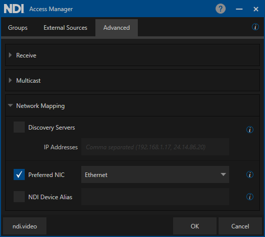

# 8. NIC Selection

Starting in NDI version 5, this lists all the network adapters that will be used for network transmission.

One or more NICs can be used to transmit and receive video and audio data. This capability can be used to ensure that the NDI primary stream data remains on a particular group of network adapters, for instance, allowing you to ensure that dedicated audio is on a separate network card from the NDI video. It is generally preferred that you let NDI select the network adapters automatically, which can smartly select which to use and how to choose the ones that result in the best bandwidth.

While in some modes, NDI can automatically balance bandwidth across multiple NICs, it usually is better for you to use NIC teaming at a machine configuration level which can result in much better performance than what is possible in software. If this setting is misconfigured to specify NICs that might not exist, then NDI might fail to function correctly.

Also, please note that the operation of computer systems that are separately on entirely different networks with different IP address ranges is often not handled robustly by the operating system, and NDI might not fully function in these configurations.

In MacOS and Linux, the NIC Selection can be manually added in the NDI configuration file located in the home directory of the effective user: "ndi-config.v1.json"

Here is the way to manually setup NIC Selection in the configuration file:

`},`\
&#x20;   `"adapters": {`\
&#x20;     `"allowed": [`\
&#x20;       `"`<mark style="color:red;">`192.168.30.8,10.10.122.123`</mark>`"`\
&#x20;     `]`

Using the NIC selection, in combination with the Discovery Server, is ultimately the best solution for controlling the NDI network.
